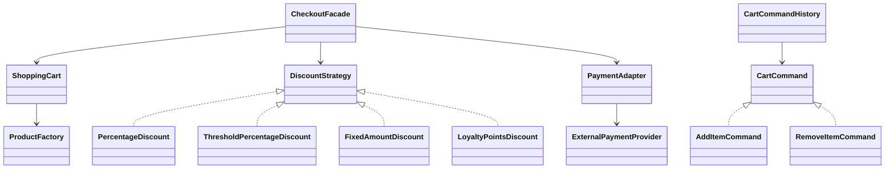

# Evolving Cart Patterns

**Student:** Arciel Aliognis Baez Zamora  
**Student number:** 221229078  
**Selected topic:** D - E-Commerce Cart

I selected the e-commerce cart because it naturally becomes hard to maintain when product creation, discounts, payment selection, and checkout rules are placed in the same class. This topic is a good fit for showing why design patterns matter: each phase removes one concrete source of change pressure from the original cart.

## Project

This repository is a design patterns homework project. It starts with an intentionally flawed cart implementation and then evolves through creational, structural, and behavioral design patterns.

The project keeps each phase visible through branches and commits:

1. Phase 0: intentionally flawed baseline.
2. Phase 1: product creation moved to a Simple Factory.
3. Phase 2: checkout orchestration and payment integration are improved with structural patterns.
4. Phase 3: discounts and cart actions become extensible with behavioral patterns.

## Current Behavior

- Add physical, digital, or subscription products to a cart.
- Remove all or part of a product quantity.
- Calculate cart subtotal.
- Checkout through a facade.
- Apply interchangeable discount strategies.
- Process payment through an adapter around an external-style provider.
- Execute and undo cart actions through commands.

## Patterns Used

| Phase | Pattern | Location | Short explanation |
| --- | --- | --- | --- |
| 1 | Simple Factory | `ProductFactory` | Centralizes product creation rules. |
| 2 | Facade | `CheckoutFacade` | Provides one clean checkout entry point. |
| 2 | Adapter | `PaymentAdapter` | Adapts provider-style payment calls to the app interface. |
| 3 | Strategy | `DiscountStrategy` classes | Makes discount behavior interchangeable. |
| 3 | Command | `AddItemCommand`, `RemoveItemCommand` | Represents cart actions as executable and undoable objects. |

## Architecture



## Run

```bash
python3 -m pip install -e .
python3 -m pytest
```

## Repository Workflow

- `main`: Phase 0 baseline and final merged result.
- `phase-1`: Creational pattern work.
- `phase-2`: Structural pattern work.
- `phase-3`: Behavioral pattern work and CI.

## Diagrams

- Phase 0 before refactoring: `docs/diagrams/phase0-before.mmd`
- Phase 1 after Simple Factory: `docs/diagrams/phase1-after.mmd`
- Phase 2 structural architecture: `docs/diagrams/phase2-architecture.mmd`
- Phase 3 final architecture: `docs/diagrams/phase3-final-architecture.mmd`
